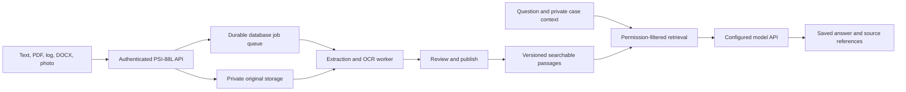

# PSI-88L — Architecture, review, and scaling

Updated: September 24, 2026. Independent first release implemented locally; hosting and live provider validation pending.

Repository: [ericfowler-dev/PSI-88L](https://github.com/ericfowler-dev/PSI-88L). The local remote is configured; no commit or push has been made. Private manuals, logs, credentials, and retained data are excluded from Git.

## How it works

The React/TanStack Start interface calls the application's authenticated API. That API owns users, cases, documents, and retrieval. A server-side adapter calls the administrator's selected AI provider. Users can build their library before connecting AI.

Uploads retain the original and create a durable job. Extraction/OCR produces passages with page or line references. Editors inspect, correct, and publish shared material. Processed private attachments are available only in their owner's case. Optional image analysis sends the chosen photo to the configured model and stores an unverified description for review.

For each question, the server retrieves passages and supplies them with conversation history to the model. Answers and evidence snapshots remain in the database across sessions. Switching providers preserves the knowledge base.

“Learning” means retaining and retrieving reviewed knowledge. Uploads do not retrain model weights. Published corrections change future retrieval; raw AI answers do not automatically become trusted sources.

## Implemented architecture

| Component | Local development | Hosted configuration |
| --- | --- | --- |
| Web and API | Node, TanStack Start, React | Independent Node web service |
| Identity | App-owned passwords and database sessions | Same; initial setup protected by server token |
| Database | Persistent PGlite under .data/ | PostgreSQL |
| Original files | Private files under .data/files/ | Private S3-compatible bucket, including R2 |
| Search | Indexed full-text search and domain synonyms | Same; no vector extension required yet |
| Jobs | Embedded worker with database queue | Separate workers with row locks, leases, heartbeats |
| AI | OpenAI, xAI, or compatible endpoint | Same server adapter and encrypted credentials |
| Limits | Database request counters | Shared across web instances |

This is one shared workspace with owner-private cases. Roles are administrator, editor, and reader (technician in the UI). Organizations, cross-user case assignment, SSO, and identity-provider integration remain future work. The original proposal's Redis queue and Better Auth integration were not needed for this first release.

OpenAI uses Responses with streaming and image input, following the official [streaming documentation](https://developers.openai.com/api/docs/guides/streaming-responses) and [image-input documentation](https://developers.openai.com/api/docs/guides/images-vision). Actual account/model compatibility remains to be verified.

## Review findings and changes

The export depended on Grok preview identity, could lose data through fallback storage/browser-only cases, and lacked retained attachment ingestion. The independent app enforces authentication and permissions, persists cases/uploads, and refuses implicit ephemeral production storage.

The previous Markdown renderer could loop on an incomplete streamed table; it now consumes incomplete rows safely. Indexed passage retrieval replaces whole-library scans and preserves short terms such as HT and LT. Tests cover permission boundaries, revisions, restart persistence, extraction, provider payloads, cancellation, and deletion.

Keyword retrieval can still miss semantically related evidence or select superficially matching passages. Citations expose the supplied evidence, but valid citation IDs do not prove every generated claim. Build a reviewed question-and-answer evaluation set from real manuals before trusting coverage.

Original Grok code is preserved in ignored legacy/grok-export/. Historical seed notes remain in their legacy table and are not automatically approved in the new library. There is no automatic import of browser-local cases; valuable old material needs a reviewed import step.

## Hosting and the new address

The user has no domain. Use an assigned hosting address for the pilot and add a custom domain later if desired. psi-88l.onrender.com is illustrative only; it is not reserved or deployed.

The Render Blueprint describes a web service, background worker, and PostgreSQL. It passed the [official JSON schema](https://render.com/schema/render.yaml.json); this is schema validation, not a deployment test. It needs a private bucket and account credentials. See [README](../README.md) for environment variables and startup.

Before a pilot, configure the database, bucket, encryption secret, initial setup token, public origin, and selected model/key. Run migrations, verify real uploads/answers, and test backup restoration. Preserve the encryption secret across deployments. No resources or paid plans have been provisioned.

## Scale in measured stages

1. **Pilot:** One web instance, one worker, managed PostgreSQL, and private object storage. Validate real manuals/logs, OCR quality, model latency, and concurrent sessions. Measure queue age, job failures, stream failures, and provider usage.
2. **More users:** Increase web capacity separately from OCR workers. Keep storage and state external. Account for five database connections per process, provider quotas, and parser memory. Use a pooled database endpoint as process counts grow.
3. **More documents:** Add pagination beyond the current 100-item lists. Evaluate hybrid keyword/vector retrieval against reviewed questions; preserve source revisions and record embedding model/version if adding vectors.
4. **Heavier ingestion:** Add short-lived authorized direct uploads, verify completed objects, isolate parsers in resource-limited processes, and add malware scanning. Current uploads pass through the API with a 20 MB limit. Scale workers by backlog and duration; adopt a dedicated queue if database scheduling becomes a measured bottleneck.
5. **Multiple organizations:** Add membership and scope every record, file, job, and retrieval query. Test isolation before offering multi-tenant access. Add SSO/recovery, administrative audit views, retention controls, and monetary spending caps.

The architecture separates web traffic, storage, search, and processing, but hosted load testing has not been performed. Capacity claims should follow measurements.

## Boundaries

English OCR can misread numbers and units. PDF diagrams and DOCX embedded images are not automatically interpreted. Logs/CSV/JSON are searchable text, not time-series analytics. Advanced equipment metadata, replacement-file versions, and one-click promotion of case material remain future work.

Deleting a source removes search passages immediately and retries original cleanup if storage is unavailable. Historical answer snapshots and backups need an explicit organization-wide erasure policy.

See the [API reference](api.md), [upload requirements](file-uploads-and-retained-knowledge.md), and [changelog](../CHANGELOG.md).
